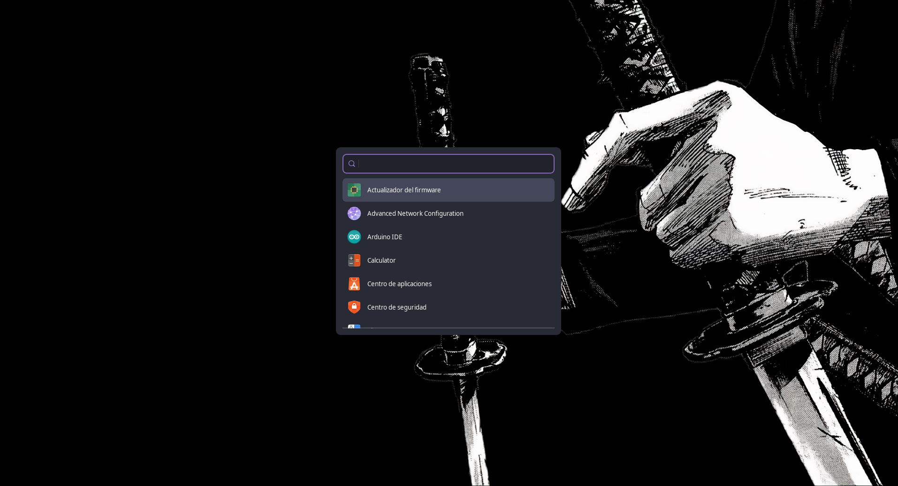

# Nyx

Un launcher de aplicaciones minimalista con tema Dracula, hecho en Python y GTK3 (PyGObject). Pensado como alternativa a Rofi para entornos como i3wm, aunque también funciona en escritorios GNOME.



## Qué hace

Nyx lee los archivos `.desktop` disponibles en las rutas estándar de datos de XDG, incluyendo las aplicaciones instaladas mediante Snap y Flatpak, y te muestra una ventana centrada con un campo de búsqueda que filtra las aplicaciones en vivo mientras escribís. Si encuentra un archivo `.desktop` mal formado o corrupto, lo saltea y continúa escaneando el resto. Al seleccionar una app (con el mouse o con las flechas del teclado) y presionar Enter, la ejecuta directamente.

Antes de listar una aplicación, Nyx verifica que su comando exista realmente en el sistema, así que no vas a ver entradas rotas que fallen al ejecutarlas. Además, muestra todos los íconos en un tamaño consistente, tanto si vienen definidos por nombre de tema como si usan una ruta de archivo absoluta.

El estilo visual sigue la paleta Dracula:
- Fondo: `#282a36`
- Acento (selección/foco): `#bd93f9`
- Selección de fila: `#44475a`

## Requisitos

- Python 3
- PyGObject (bindings de Python para GTK3)
- GTK3

En Ubuntu/Debian podés instalar las dependencias con:

```bash
sudo apt install python3-gi gir1.2-gtk-3.0
```

## Instalación

1. Cloná el repositorio:

```bash
git clone https://github.com/ImJustSebas/nyx.git
cd nyx
```

2. Dale permisos de ejecución al script:

```bash
chmod +x launcher.py
```

3. Probá que funcione correctamente:

```bash
./launcher.py
```

Si se abre la ventana con el campo de búsqueda y podés filtrar y lanzar aplicaciones, ya está listo para configurarse como tu launcher por defecto.

## Configuración

### En i3wm

Si venías usando Rofi (o cualquier otro launcher) con un atajo de teclado, editá tu archivo de configuración de i3, normalmente ubicado en `~/.config/i3/config`.

Buscá la línea que lanza tu launcher actual, por ejemplo:

```
bindsym $mod+d exec rofi -show drun
```

Y reemplazala por la ruta a Nyx en tu sistema:

```
bindsym $mod+d exec /ruta/completa/a/nyx/launcher.py
```

Para quitar la decoración y tratarlo como una ventana flotante, añadí esta regla a `~/.config/i3/config`:

```
for_window [class="DraculaLauncher"] border none, floating enable, resize set 480 400, move position center
```

Después de guardar, recargá i3:

```bash
i3-msg reload
```

Recordá usar la ruta absoluta (por ejemplo `/home/tu_usuario/nyx/launcher.py`), ya que i3 no siempre resuelve rutas relativas o con `~`.

Después de guardar el archivo, recargá la configuración de i3 sin cerrar sesión:

```bash
i3-msg reload
```

O usá el atajo por defecto de i3 para recargar (`$mod+Shift+c`).

### En GNOME

GNOME no tiene un sistema nativo de keybindings tan flexible como i3, pero podés asignarle un atajo de teclado personalizado desde la configuración del sistema:

1. Abrí **Configuración** → **Teclado** → **Atajos de teclado personalizados** (el nombre exacto puede variar según tu versión de GNOME).
2. Agregá un atajo nuevo.
3. En **Comando**, poné la ruta absoluta al script, por ejemplo:

```
/home/tu_usuario/nyx/launcher.py
```

4. Asigná la combinación de teclas que prefieras (por ejemplo, `Super+D`, si no está ocupada por el launcher nativo de actividades de GNOME).

También podés hacerlo desde terminal con `gsettings`, aunque el método gráfico suele ser más simple para una única entrada personalizada.

## Personalización

El estilo visual está definido en `style.css`, en la misma carpeta que `launcher.py`. Podés editar los colores, tipografía y espaciados directamente ahí si querés ajustar el tema a tu gusto.
